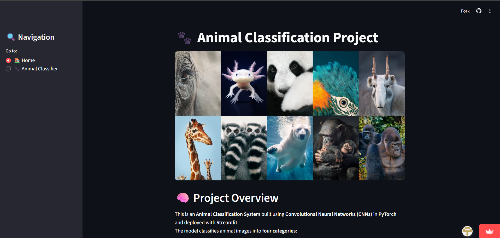
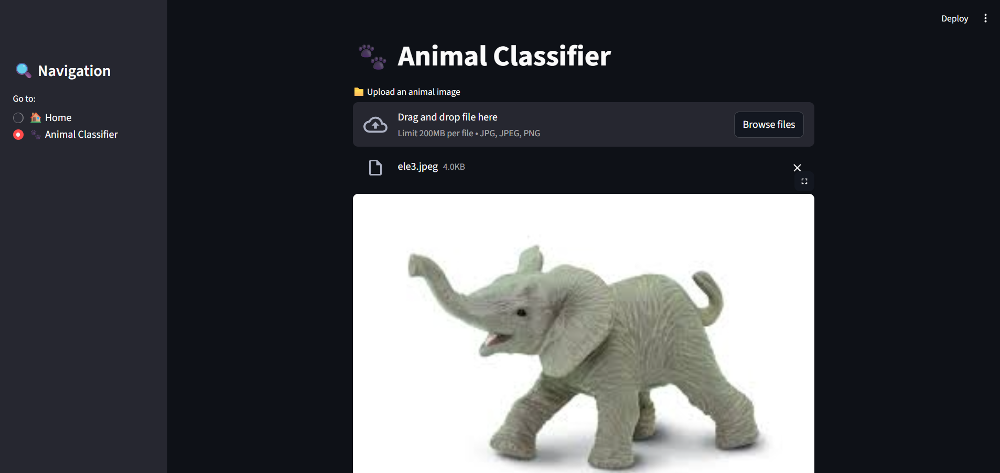
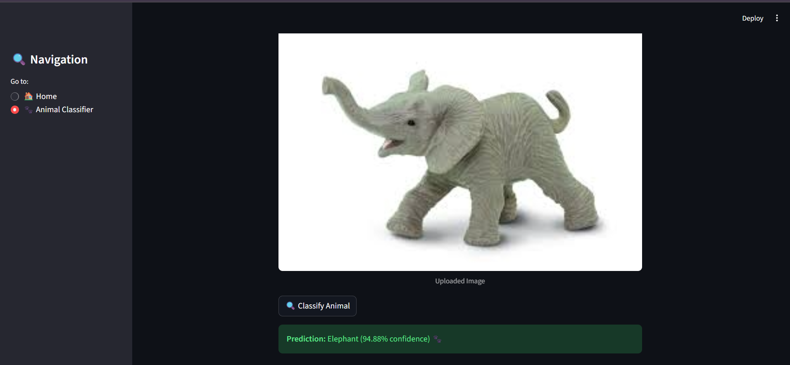

#  Animal Classification using CNN and Streamlit

This project is a **Deep Learning-based Animal Classification App** built using **PyTorch** and **Streamlit**.  
It can classify uploaded images of animals into one of four categories:
**Buffalo, Elephant, Rhino, or Zebra**.

---

## Features
- 🧠 CNN model (ResNet18) trained using PyTorch  
- 📸 Upload an animal image and classify it instantly  
- 💬 Shows confidence score for predictions  
- ⚠️ Displays message when confidence is low or uncertain  
- 🌐 Simple and interactive Streamlit web app  

---

## Installation

Install my-project with npm

1. Clone the repository:
   ```bash
   https://github.com/patilatharva21/Animal_Classification.git
   ```
2. Install the required Python packages:
    ```bash
    pip install -r requirements.txt
    ```
3. Set the paths of files as per your directory structure

4. Run the application:
    ```bash
    streamlit run app.py

## 🖼️ Project Output

### Home Page


### Upload and Classify


### Classification Result 1


### Classification Result 2


